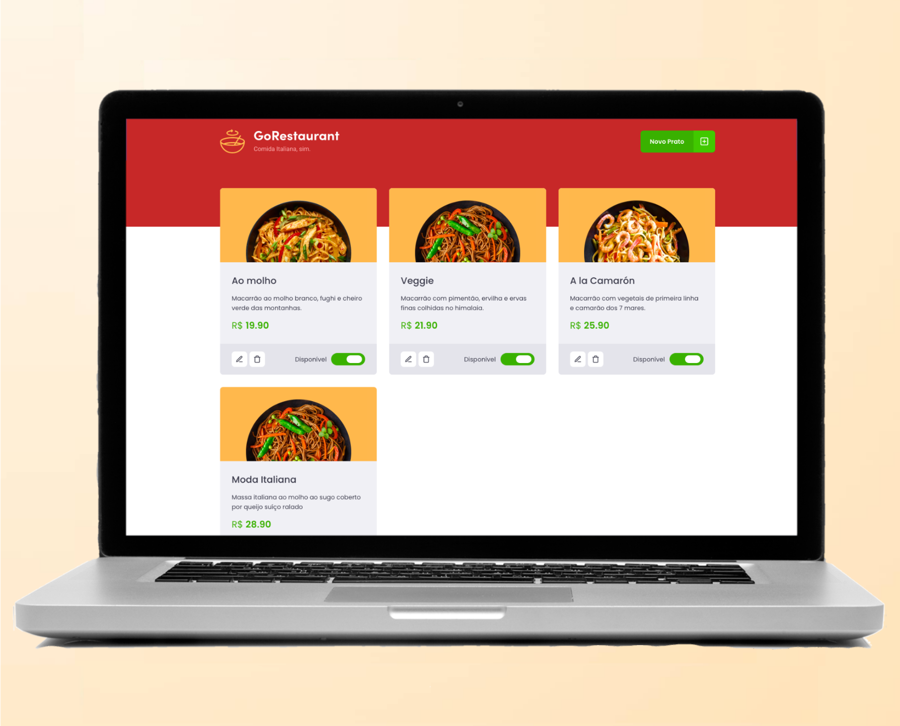

<h1>
  
</h1>

[](https://github.com/roperes98/PoC-ReactJs/blob/master/LICENSE)


<h1>
    
</h1>

## 📚 Indice
- [Sobre](#-sobre)
- [Tecnologias utilizadas](#-tecnologias-utilizadas)
- [Como baixar o projeto](#-como-baixar-o-projeto)

⠀⠀⠀⠀⠀⠀⠀⠀

---

⠀⠀⠀⠀⠀⠀⠀⠀

## 🔖 Sobre

O projeto GoRestaurant é um site de delivery de comida, onde foi praticado o conceito de CRUD (Create, Read, Update, Delete) para estudo.

⠀⠀⠀⠀⠀⠀⠀⠀
## 🚀 Tecnologias utilizadas

O projeto foi desenvolvido utilizando as seguintes tecnologias:

- [ReactJS](https://reactjs.org)
- [typescript](https://www.typescriptlang.org)

⠀⠀⠀⠀⠀⠀⠀⠀

## 🗂 Como baixar o projeto

```bash

  # Clonar o repositório
  $ git clone https://github.com/roperes98/PoC-ReactJs.git

  # Entrar no diretório
  $ cd Poc-ReactNative

  # instalar as dependências
  $ yarn install
  
  # Iniciar fake server
  $ yarn json-server server.json -p 3333

  # Iniciar o projeto
  $ yarn start

```
⠀⠀⠀⠀⠀⠀⠀⠀

---
⠀⠀⠀⠀⠀⠀⠀⠀<br>
Desenvolvido por Rodrigo Peres! 👾
